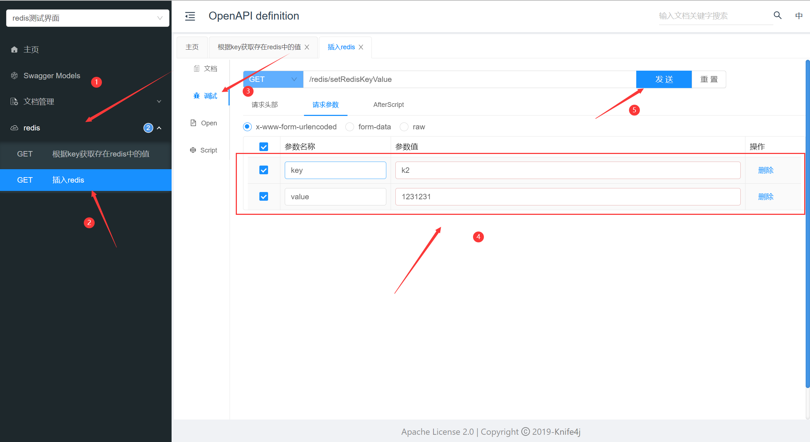

## 主从复制和哨兵模式

> 下面命令都是在redis-master-slave-sentry目录下执行
### 赋予权限
```shell
chmod -R 777 logs
chmod -R 777 sentinel*.conf
```

### 部署主从复制+哨兵模式
```shell
docker-compose up -d
```

> redis.conf是官方配置文件
> sentinel.conf是官方配置文件


## redisdemo
> redisdemo项目是用于测试主从+哨兵模式的主节点挂掉后从节点上位后springboot是否能用
### 测试流程
1. 修改application.yml配置文件中redis的ip地址，改为你自己的
2. 启动redisdemo项目
3. 在浏览器输入knife4j在线调试地址：http://localhost:8091/doc.html
4. 设置一个key-value，验证是否连通部署的redis主从+哨兵

5. 在服务器stop主节点的redis
```shell
docker stop 主节点容器id
```
6. 查看控制台日志从节点是否上位成功
7. 在knife4j在线调试地址进行设置key-value看能否插入数据成功
